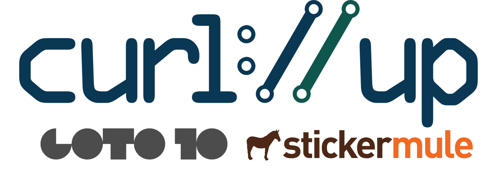

curl up is our annual curl conference and developers meetup. We talk and discuss
everything and anything curl related.

# April 14-15, 2018

* Where: Stockholm, Sweden at [Goto 10](https://www.goto10.se/english/) - [map](https://goo.gl/maps/ZuG5Ew5J1z22)
* Saturday + Sunday event - [agenda](curl-up-2018-agenda)
* Room for 40 attendees
* Potentially a "pre-event" on Friday the 13th for some hands-on programming/debugging

# Sign up?

You cannot sign up yet. We will open up for attendees to sign up around the end of January 2018. An exact time and date will be announced a week or two before that happens.

# Fee

This event will be **completely free of charge to attend**. You will probably be nagged multiple times about your sincere intention to actually participate so that we can minimize the amount of drop-outs.

# Sponsors

[Goto 10](https://www.goto10.se/) graciously sponsors the venue

[Stickermule](https://www.stickermule.com) is our official stickers sponsor.

... discussions with more sponsors are ongoing.

# Planning / volunteering

Yes we need your help both in planning and helping out at the actual event. Subscribe to [curl-meet](https://cool.haxx.se/mailman/listinfo/curl-meet) and participate! 

# Last year

[curl up 2017](https://github.com/curl/curl/wiki/curl-meeting-2017)
